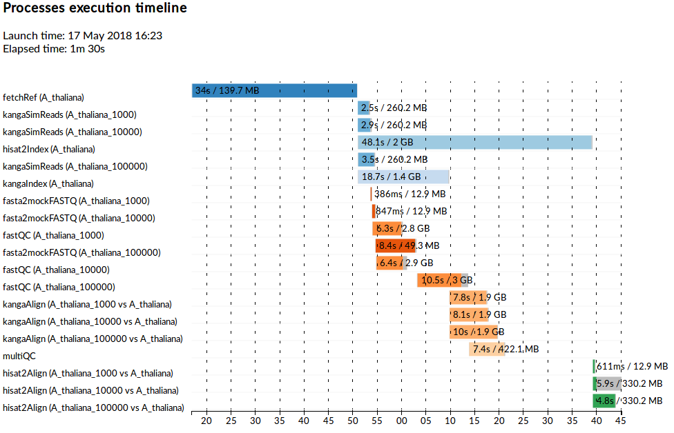
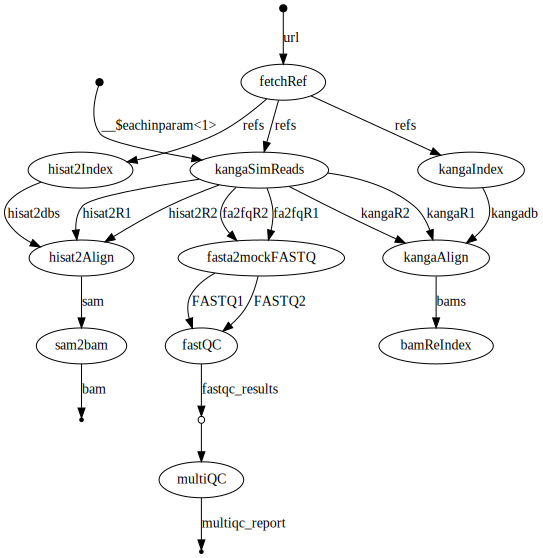

Job execution using [](https://www.nextflow.io/)
--------------------------------------------------------

We use [nextflow](https://www.nextflow.io/) to handle compute. One way to make nextflow available on your system: 

`curl -s https://get.nextflow.io | bash && mkdir -p ~/bin && mv nextflow ~/bin && PATH+=":~/bin"`

Current set-up executes a simple test pipeline composed of the following processes

* `curl` 
  * download a genome assembly
* [`biokanga`](https://github.com/csiro-crop-informatics/biokanga) 
  * reference indexing 
  * short read simulation
  * short read alignment 
* [`hisat2`](https://ccb.jhu.edu/software/hisat2/)
  * reference indexing
  * short read alignment
* [`samtools`](http://www.htslib.org/) 
  * converting `hisat2` output SAM to BAM
* FastQC and MultiQC on (for now) simulated reads converted from FASTA to mock FASTQ


The pipeline logic is largely separated from the execution environment configuration. 
Currently to keep the set-up modular, we opt for container per tool, but if required for efficiency these could be packaged in a single container as far as practical, subject to dependency/environment compatibility.

Below, we list several alternative ways of executing the same pipeline. This assumes you have cloned this repository and run the pipeline in its main directory. Alternatively, replace `nextflow main.nf` with `nextflow run csiro-crop-informatics/reproducible_poc -r develop` to let nextflow handle pulling the repository prior to execution. If you have done so before, run `nextflow pull csiro-crop-informatics/reproducible_poc` to make sure you have the latest revision. 

### Alternative ways of running the pipeline

Note, for any of the below using `-resume` prevents processes from being re-run if neither input nor scripts have changed.

#### Local/interactive with required software assumed to be available:

``` nextflow main.nf```

#### Local/interactive with required software loaded via `module` directives:

```nextflow main.nf -profile modules```

#### In container(s) using docker:

```nextflow main.nf -profile docker```

<!--Note that this option may cause permissions-based errors, things are -->
<!--much more straightforward with singularity - see below.-->


#### In container(s) using singularity:

```nextflow main.nf -profile singularity```

#### On a SLURM cluster with modules:

```nextflow main.nf -profile slurm,modules```

Execution profiles used: 

* `slurm` profile sets some SLRUM defaults and ensures processes are submitted using `sbatch`
* `modules` profile facilitates loading of required software modules
  * You may have to update the required modules names/versions in [`conf/modules.config`](conf/modules.config) to match those available on your system

#### In container(s) using singularity on a SLURM cluster with singularity module available

```
module load singularity
nextflow main.nf -profile slurm,singularity,singularitymodule
```

Execution profiles used:

* `slurm` profile sets some SLRUM defaults and ensures processes are submitted using `sbatch`
* `singularity` profile facilitates pulling and converting appropriate docker images 
* `singularitymodule` profile ensures singularity module is loaded on each execution node


#### On AWS EC2 cloud 


##### Prerequisites

* Create AWS account and log into your AWS account console
* Go to *EC2 Dashboard -> NETWORK & SECURITY -> Security Groups* and add/update rule in the default AWS Security Group to allow incoming TCP traffic on all ports (port 22 required for ssh, a range of ports required for intra-cluster communication)
* Go to *EC2 Dashboard -> NETWORK & SECURITY -> Key Pairs* and upload a public ssh key. Ideally, use a key different to your default one in which case you also need to set its location under `cloud` in `nextflow.config`, e.g. `cloud.keyFile = '~/.ssh/id_rsa2.pub'`
* Setup AWS programmatic access configuration on your local machine. Nextflow must be able to pick-up your credentials to connect to AWS and spawn a virtual cluster. One way to set things up:
  * As root/sudo `apt install awscli`
  * Run `aws config`
  * Set AWS access ID to the one generated in your AWS account console 
  * Set AWS access key to the one generated in your AWS account console 
  * Set default region to `eu-west-1` (Ireland) where a pre-configured nextflow AMI (`ami-4b7daa32`) is available. We use `ap-southeast-2` (Sydney) instead, but this required cloning the AMI to make it available in this region. The cloned AMI is `ami-054c4e0bad8549c37`.
* Create EFS volume, record details for `cloud` settings in [`nextflow.config`](nextflow.config). The settings need to be specific to your account, but should follow this pattern

```
cloud {
    imageId = 'ami-4b7daa32'              // AMI available in eu-west-1
    subnetId = 'subnet-80f749c8'          // Specific to where you set-up your EFS
    sharedStorageId = 'fs-ec6cf125'       // Your EFS ID
    keyFile = '/path/to/.ssh/id_rsa.pub'  // If using non-default key pair
    instanceType = 't2.medium'
    userName = 'your_aws_username'
    //Optional:
    autoscale {
      enabled = true
      minInstances = 1
      maxInstances = 8
      spotPrice = 0.09 
      instanceType = 'm5.xlarge'
      terminateWhenIdle = true
    }
}
```

For more details and background reading see [Nextflow](https://www.nextflow.io/docs/latest/config.html#scope-cloud) and AWS/EC2 documentation.

##### EC2 execution

**NOTE!!! You will be charged according to your resource use. Monitor/terminate your instances in AWS console!**

Run `nextflow cloud create my-cluster -c 2` to instantiate a cluster with 1 worker node and a master node (which is also used for compute). Wait until the nodes are instantiated and responsive, then ssh into your master node as per instruction printed in your terminal e.g. 

```
ssh -i /path/to/.ssh/id_rsa your_aws_username@ec2-13-999-211-199.ap-southeast-2.compute.amazonaws.com
```

If you get access denied give it a couple of minutes before trying again as ssh server may not be up yet. 

From the master node, nextflow can pull the pipeline from this repo and run it

```
./nextflow run csiro-crop-informatics/reproducible_poc -r develop -profile ec2 --nreadsarr 10000
```

* nextflow will use [Apache Ignite cluster](https://apacheignite.readme.io/v1.0/docs/cluster) executor

Depending on the compute requirements and whether your [`nextflow.config`](nextflow.config) contains the `autoscale` settings, additional worker nodes may be instantiated to execute processes. 
<!--Given current resource and input settings, an additional `m4.large` instance is added to the cluster.-->

After the job is complete you can transfer or [sync](https://docs.aws.amazon.com/efs/latest/ug/gs-step-four-sync-files.html) your result files. **Don't forget to remove any reminining data from EFS, or it will continue to accumulate cost**, if you want to keep data on aws, set-up a cheaper S3.

```
rm -rf /mnt/efs/*
```

Logout from the master node and shutdown the cluster either from AWS console or from your local command line by running `nextflow cloud shutdown my-cluster`. Just in case, **double check the list of instances in AWS console to ensure there is nothing left running and costing you $$$s**.


### Execution summary report, timeline and trace

After execution of the pipeline `report.html` ([such as this one](https://rsuchecki.github.io/reproducible.github.io/report.html)) and `timeline.html` ([like this one](https://rsuchecki.github.io/reproducible.github.io/timeline.html)) are created under `flowinfo/`, where you will also find execution `trace.txt`. 
The timeline below illustrates the execution of the pipeline for varying number of simulated reads at 1k, 10k and 100k.



### Pipeline flowchart

A digraph representation of the pipeline can be produced by nextflow. This can be HTML (`-with-dag flowchart.html`), a [DOT language](https://www.graphviz.org/doc/info/lang.html) file or a figure (pdf, png, svg) generated from DOT if Graphviz is available e.g. `-with-dag flowchart.svg` 




